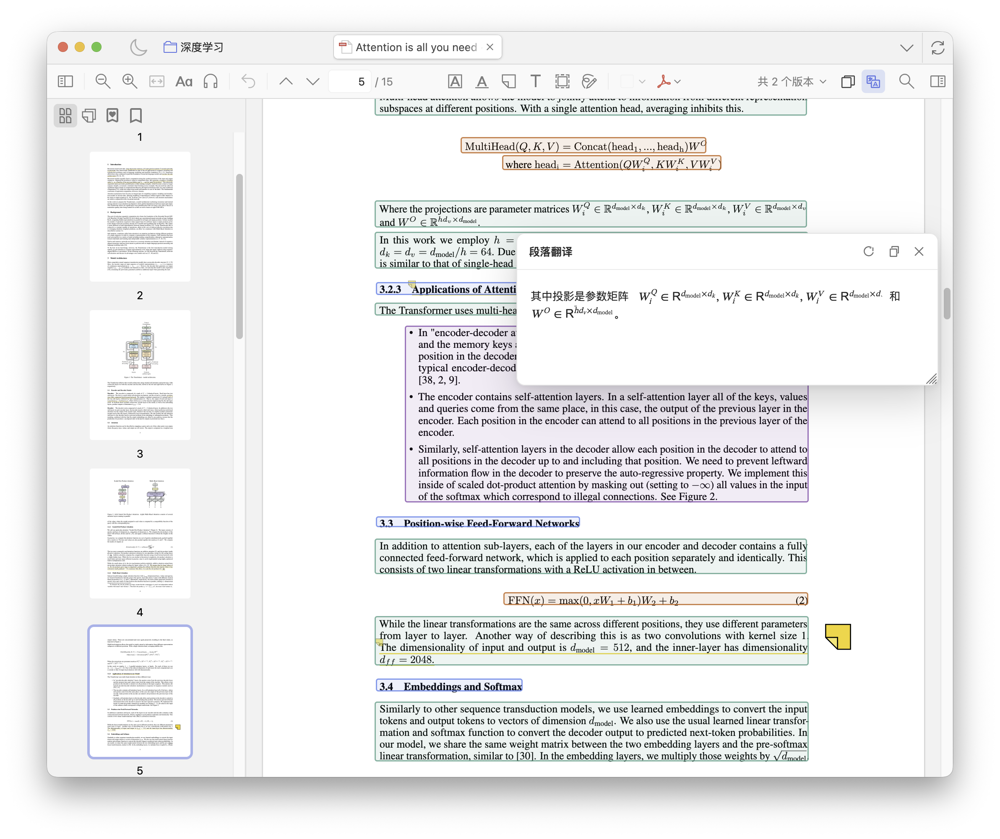

<p align="center">
  
</p>

<h1 align="center">Zotero Mark Reader</h1>

<p align="center">
  用 MinerU 解析 PDF，并在 Zotero 阅读器中以段落框选择、复制和翻译 Markdown。
</p>

<p align="center">
  <a href="https://github.com/jin-taiyu/zotero-mark-reader/releases"></a>
  <a href="https://github.com/opendatalab/MinerU"></a>
  
  <a href="LICENSE"></a>
</p>

## 功能

- 在 PDF 附件或包含 PDF 的条目上右键选择 **使用 MinerU 解析 PDF**。
- 支持 MinerU 在线 API 与本地 `mineru-api`。
- 在 Zotero PDF 阅读器顶部提供 **单击复制** 与 **单击翻译** 两种模式。
- 段落翻译窗口支持 Markdown、公式渲染、流式输出，以及原文/译文编辑与保存。
- 可在段落翻译窗口中使用文档上下文、领域专家和术语表高级重译当前段落。
- 在 PDF 或父条目的右键菜单中启动 **全文翻译**，支持真实进度、暂停、继续、取消、失败重试与断点续翻。
- 全文翻译支持 AI 智能上下文、领域专家、全局术语表和自动生成的单篇术语表。
- 翻译缓存按目标语言、模型、提示词、上下文和术语配置保存多个版本，并实时同步到已打开的阅读器。

<p align="center">
  
</p>

## 安装

从 [GitHub Releases](https://github.com/jin-taiyu/zotero-mark-reader/releases) 下载最新 `.xpi` 文件。
在 Zotero 中打开 **工具 -> 插件**，将 `.xpi` 文件拖入插件窗口。

## 兼容性

- Manifest 声明范围：Zotero `8.0` 到 `10.0.*`
- 当前版本仅支持 PDF 附件

## 本地 MinerU API

MinerU 官方文档要求 Python `3.10-3.13`。建议在独立虚拟环境中安装：

```sh
python -m venv .venv
source .venv/bin/activate
pip install -U pip uv
uv pip install -U "mineru[all]"
```

如无法访问 Hugging Face，可按官方说明切换模型源后启动本地 API：

```sh
export MINERU_MODEL_SOURCE=modelscope
mineru-api --host 127.0.0.1 --port 8000
```

在插件设置中选择 **本地 MinerU API**，接口地址使用 `http://127.0.0.1:8000`，然后点击 **验证 MinerU 接口**。

## 配置存储

插件设置保存在 Zotero 用户配置中，键名前缀为 `extensions.zotero.zoteroMarkReader.*`。卸载插件不会自动删除这些偏好项；重新安装后 Zotero 会继续读取原配置。

解析结果保存在 Zotero profile 下的 `zotero-mark-reader/attachments/<attachment-key>/`，其中包含 `parse.json`、`full.md`、`raw/` 和可选的 `result.zip`。

全文翻译结果、单篇上下文分析和单篇术语保存在同目录的 `translation-cache.json`。该文件独立于 `parse.json`，重新解析 PDF 或关闭翻译任务窗口不会丢失已经完成的译文。全局术语表保存在 Zotero 用户配置中。

## 官方资料

- [MinerU 仓库](https://github.com/opendatalab/MinerU)
- [MinerU 快速入门](https://opendatalab.github.io/MinerU/zh/quick_start/)
- [MinerU 使用指南](https://opendatalab.github.io/MinerU/usage/)
- [MinerU 在线 API 文档](https://mineru.net/apiManage/docs)
- [Zotero 插件文档](https://www.zotero.org/support/dev/client_coding/plugin_development)
- [Zotero 版本兼容说明](https://www.zotero.org/support/dev/zotero_7_for_developers)
